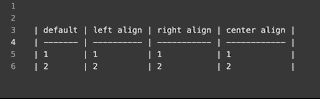

# Changelog

All notable changes to this project will be documented in this file.

The format is based on [Keep a Changelog](http://keepachangelog.com/en/1.0.0/)
and this project adheres to [Semantic Versioning](http://semver.org/spec/v2.0.0.html).

# 1.6.0
### Changed

- Improved performance
- Updated dependencies

# 1.5.0
### Added
#### Disable command
Disable extension command. This will let you disable the table mode and hides the status item.

#### Tables in comment blocks
Added support for tables in comment blocks.

Currently, there is support for three types of comments:

```
#  | first | second |
#  | a     | b      |

//  | first | second |
//  | a     | b      |

/*
 *  | first | second |
 *  | a     | b      |
 */
```

Tables at the block comment start are not supported at the moment.

# 1.4.2 - 2021-10-22

### Changed

- Updated dependencies


# 1.4.1 - 2021-07-22

### Changed

- Updated dependencies


# 1.4.0 - 2021-03-23

### Added

- Align text in columns based on the given alignment

Example:
```markdown
| default | left | right | center |
| ------- |:---- | -----:|:------:|
| 1       | 1    |     1 |    1   |
| 2       | 2    |     2 |    2   |
```




# 1.3.0 - 2021-03-20

### Added

- Column alignments: 
  - left `|:--- |`
  - right `| ---:|`
  - centered `|:---:|`
  - default `| --- |`

### Changed

- Improved table prefix handling

# 1.2.1 - 2021-03-14

### Changed

- Updated description

# 1.2.0 - 2021-03-14

### Changed

- Fixed a rare issue while jumping through the table.
- Dependency updates

### Removed

- Removed `Org` mode. The parser lacks some features (e.g. escaping), and I don't plan to test and use this.


# 1.1.1 - 2021-03-13

- Optimized release build
- Dependency updates

# [1.1.0] - 2021-03-13
[1.1.0]: https://github.com/philipparndt/vscode-markdown-tables/releases/tag/1.1.0-b1

- Use EOL character form vscode.TextEditor
- Keep current indentation of the table when formatting
- Avoid flicker during navigation without change
- Support insert a column left to the current position
- Toggle the table mode using the status item
- Gherkin feature file support
- Column deletion command
- Implemented an EBNF parser to support special characters
- Fixed tests when run from command line.

## [0.1.5] - 2018-05-03

### Added

- Command `text-tables.nextRow` (`Text Tables: Next row` in command palette) for jumping on next row and creating new rows if needed.

### Changed

- Command `text-tables.gotoNextCell` (`Text Tables: Go to next cell` in command palette) inserts new row when applied in last data cell of table.
- Fixed markdown parser for tables with separator row where separator row has less columns than other row (#33).

## [0.1.0] - 2018-04-16

### Changed

- Codebase refactor.
- Preview status removed from extension.

## [0.0.9] - 2018-04-14

### Added

- Command `Move row down` to move row down in table mode.
- Command `Move row up` to move row up in table mode.
- Command `Move column right` to move column right in table mode.
- Command `Move column left` to move column left in table mode.

## [0.0.8] - 2018-04-14

### Changed

- Fixed `Create table` command for markdown (#24).

## [0.0.7] - 2018-04-13

### Changed

- Table mode made local to editor (#22).

## [0.0.6] - 2018-04-12

### Changed

- Shortcuts readme update

## [0.0.5] - 2018-04-12

### Added

- Command `text-tables.enable` (`Text Tables: Enable` in command palette) for activating extension in any file.
- Command `text-tables.clearCell` (`Text Tables: Clear cell` in command palette) for clearing cell under cursor.

## [0.0.4] - 2018-04-11

### Added

- Setting `text-tables.showStatus` to control whether status item for mode should be visible.

## [0.0.3] - 2018-04-07

### Changed

- Navigation now via `Tab` and `Shift`+`Tab` skips separator rows

## [0.0.2] - 2018-04-05

### Added

- `Create table` command.

### Changed

- Linting settings.
- Readme file updated with additional badges.

## [0.0.1] - 2018-03-24

- Initial release
[0.1.5]: https://github.com/rpeshkov/vscode-text-tables/compare/v0.1.0...v0.1.5
[0.1.0]: https://github.com/rpeshkov/vscode-text-tables/compare/v0.0.9...v0.1.0
[0.0.9]: https://github.com/rpeshkov/vscode-text-tables/compare/v0.0.8...v0.0.9
[0.0.8]: https://github.com/rpeshkov/vscode-text-tables/compare/v0.0.7...v0.0.8
[0.0.7]: https://github.com/rpeshkov/vscode-text-tables/compare/v0.0.6...v0.0.7
[0.0.6]: https://github.com/rpeshkov/vscode-text-tables/compare/v0.0.5...v0.0.6
[0.0.5]: https://github.com/rpeshkov/vscode-text-tables/compare/v0.0.4...v0.0.5
[0.0.4]: https://github.com/rpeshkov/vscode-text-tables/compare/v0.0.3...v0.0.4
[0.0.3]: https://github.com/rpeshkov/vscode-text-tables/compare/v0.0.2...v0.0.3
[0.0.2]: https://github.com/rpeshkov/vscode-text-tables/compare/v0.0.1...v0.0.2
[0.0.1]: https://github.com/rpeshkov/vscode-text-tables/releases/tag/v0.0.1
