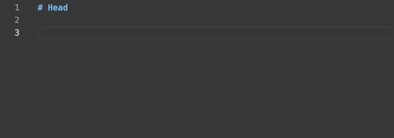
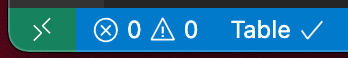

# Text Tables

[![version][version-badge]][CHANGELOG]
[![license][license-badge]][LICENSE]


VSCode extension that helps you formatting markdown tables in GitHub style.



## Features

- Tables reformat
- Easy table cells navigation

## Activation

- Open a markdown or a Cucumber document
- Activate Table mode using the bottom toolbar or by using the Command Palette `Markdown Tables: Enter table mode`

## Commands

The extension provides several commands that are available in the Command Palette:

- `Markdown Tables: Enable` - enable extension.
- `Markdown Tables: Create table` - create a new table at the cursor position.
- `Markdown Tables: Format under cursor` - reformat the table under the cursor.
- `Markdown Tables: Enter table mode` - enter [table mode](#table-mode).
- `Markdown Tables: Exit table mode` - exit [table mode](#table-mode).
- `Markdown Tables: Go to next cell` - switch to the next cell in the current table.
- `Markdown Tables: Go to the previous cell` - switch to the previous cell in the current table.
- `Markdown Tables: Clear cell` - clear cell under the cursor.
- `Markdown Tables: Create column left to` - create a new column left to the current column.

You can access all of the above commands from the command palette (<kbd>Ctrl</kbd>+<kbd>Shift</kbd>+<kbd>p</kbd> or <kbd>Cmd</kbd>+<kbd>Shift</kbd>+<kbd>p</kbd>)

## Table mode

Table mode is the mode where some of the default keybindings have another action assigned.

To enter table mode you may execute command `Text Tables: Enter table mode` from command palette or press <kbd>Ctrl</kbd>+<kbd>q</kbd> <kbd>Ctrl</kbd>+<kbd>q</kbd> shortcut to toggle mode. To control whether you're in table mode or not, see the icon in the status bar of Visual Studio Code:



When in table mode, <kbd>Tab</kbd> and <kbd>Shift</kbd>+<kbd>Tab</kbd> keybindings will navigate next/previous cell accordingly.

## Keybindings

- <kbd>Ctrl</kbd>+<kbd>q</kbd> <kbd>f</kbd> - format table under cursor.
- <kbd>Ctrl</kbd>+<kbd>q</kbd> <kbd>space</kbd> - clear cell under cursor.
- <kbd>Ctrl</kbd>+<kbd>q</kbd> <kbd>Ctrl</kbd>+<kbd>q</kbd> - toggle table mode.

### In table mode

- <kbd>Tab</kbd> - navigate to the next cell in table.
- <kbd>Shift</kbd>+<kbd>Tab</kbd> - navigate to the previous cell in table.
- <kbd>Alt</kbd>+<kbd>Numpad +</kbd> - create a new column left to the current position.
- <kbd>Alt</kbd>+<kbd>Numpad -</kbd> - delete current column.

### Custom keybindings

The extension introduces additional `tableMode` when-clause that you may use to define your own keybindings when in table mode.

Sample keybinding:

```json
{
 "key": "tab",
 "command": "text-tables.gotoNextCell",
 "when": "tableMode"
}
```

## Settings

This extension introduces some settings that you may setup in your user settings or workspace settings.

Available settings:

- `text-tables.mode` - sets the type of tables. Valid values are: `org` and `markdown`.
- `text-tables.showStatus` - controls whether to show or not status item for table mode.

## Fork information
This extension was originally created by Roman Peshkov and named [vscode-text-tables](https://github.com/rpeshkov/vscode-text-tables).
As there was no progress on the project and I had some issues that needed to be fixed, I created and used this version
privately for a long time. When the original project comes back to life, I'm happy to create PRs for the new features.

### New features/fixes compared to the original version

- Use EOL character form vscode.TextEditor
- Keep current indentation of the table when formatting
- Avoid flicker during navigation without change
- Support insert a column left to the current position
- Toggle the table mode using the status item
- Gherkin feature file support
- Column deletion command
- Implemented an EBNF parser to support special characters

## Contribution

All contributions are welcome.

If you found a bug or want to propose a new feature for the extension, please create an issue.

[CHANGELOG]: ./CHANGELOG.md
[LICENSE]: ./LICENSE
[version-badge]: https://img.shields.io/badge/version-1.1.0-blue.svg
[license-badge]: https://img.shields.io/badge/license-MIT-blue.svg